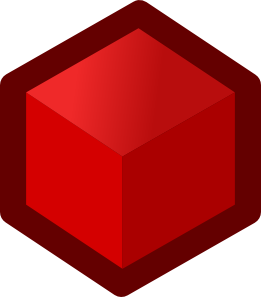
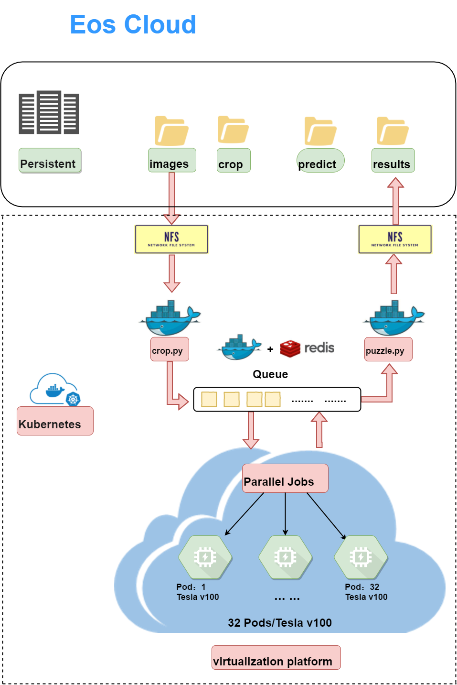

## RedKube 

Kubernetes with Redis worker queues for accelerating inference of object detection models on satellite images.

### Overview
RedKube is aimed to enable scaling and speeding up of object detection models which are compatible with the [SatelliteAnnotationProcessor](https://git.iai.local/ash95/satelliteannotationsprocessor) repository. So the full pipeline would be as follows:

1. **Research**: Building models and doing inference in pixel space  (Refer [PANet](https://git.iai.local/ash95/panet) repository)
2. **Geo-Inference**: Using the models developed by the research team to do inference on large geotiffs to produce detections in geojson format (Refer [SatelliteAnnotationProcessor](https://git.iai.local/ash95/satelliteannotationsprocessor) repository) 
3. **Scaled Geo-Inference**: For scaling and speeding up of model inference ([This](https://git.iai.local/ash95/redkube) repository)

Primarily, there are two components to RedKube (and I imagine every other cluster setup), the shared storage and the models. RedKube uses NFS as the shared storage for storing images and the yamls for setting up the observer pod and redis. The models folder will essentially contain the code you used for geo-inference and yaml files for setting up the worker pods. If using a pre-built cluster (which should be the case), the user need only provide code related to the model and leave the nfs folder untouched.

### RedKube Workflow

The final workflow of the redkube project is shown below:

1. 

   
  
 

### Requirements:
1. Your code is compatible with the [SatelliteAnnotationProcessor](https://git.iai.local/ash95/satelliteannotationsprocessor) repository. If it works, you'll need to build your code as a docker image.
2. A Kubernetes cluster. If you are starting from scratch, kindly refer Nekruzjon's [repo](https://git.iai.local/Maxudov/kubernetes) for a brief review of kubernetes and instructions on how to setup a cluster. Refer this [link](https://git.iai.local/Maxudov/kubernetes/blob/master/examples/redkube.md) if you want to jump right in.

<!--### Setup:-->
<!--Assuming you have the cluster setup. You'll need to do the following steps:-->
<!--1. Create a persistent volume (PV) and persistent volume claim (PVC) for your model. You'll also have a PV and PVC for the nfs volume which is shared by all the models and is mounted to the mnt directory in the container. Follow the example from the panet and sniper examples-->
<!--2. Push the service image to a registry (local or public) so it's easily accessible by all nodes in your cluster.-->

**Note:** Still a work in progress (WIP), so expect some bugs. Kindly contact me or Jian for any assistance.

### Todo
1. Update docker image with yaml library 
2. Test with large image and do a speed comparison
3. Check why cleanDatabox is not created

### Contributors
1. [Jian Song](https://github.com/JTRNEO)
2. [Ashwin Nair](https://github.com/ash1995)
